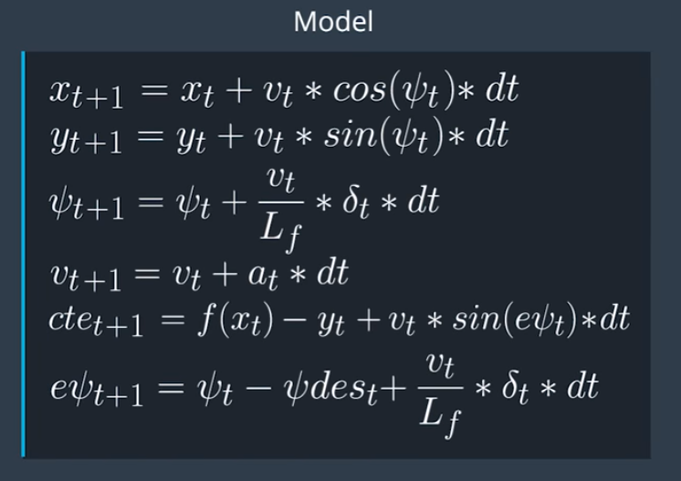

# Udacity Self-Driving Car Engineer Nanodegree Program
# *Model Predictive Controller Project*

## Intro

This project is an implementation for the MPC. Tested on Udacity term 2 simulator. Poroject takes 100ms delay into account.

## Rubric Points

- **The Model**: *Student describes their model in detail. This includes the state, actuators and update equations.*

The kinematic model includes the vehicle's x and y coordinates, orientation angle (psi), velocity, CTE and psi error (epsi). 
The model calculates the state for the current timestep based on the following equations :



- **Timestep Length and Elapsed Duration (N & dt)**: *Student discusses the reasoning behind the chosen N (timestep length) and dt (elapsed duration between timesteps) values. Additionally the student details the previous values tried.*

The values chosen for N is 10 and dt is 0.1 as suggested by Udacity's Q&A video. 
These values mean that the optimizer is considering a one-second duration in which to determine a corrective trajectory. 
I've also tried 
  10 / 0.05 which produced more accurate trajectory points for 0.5 sec but some how limited car speed
  20 / 0.05 which produced more accurate trajectory points but incleased processing time and caused more latency
  10 / 0.2 which caused a delayed trajectory corrective actions and caused the car to jump out of the road in the turns.


- **Polynomial Fitting and MPC Preprocessing**: *A polynomial is fitted to waypoints. If the student preprocesses waypoints, the vehicle state, and/or actuators prior to the MPC procedure it is described.*

As a preprocessing step i transformed the waypoints (in simulator coordenate system) to vehicle's prespective which simplified the polynomial fitteng. I used the povided polynomial fitting function to perform the operation.

- **Model Predictive Control with Latency**: *The student implements Model Predictive Control that handles a 100 millisecond latency. Student provides details on how they deal with latency.*

The approach to dealing with latency is that the original kinematic equations depend upon the actuations from the previous timestep, but with a delay of 100ms the actuations are applied another timestep later, so the equations have been altered to account for this (MPC.cpp lines 125-128).


---

## Dependencies

* cmake >= 3.5
 * All OSes: [click here for installation instructions](https://cmake.org/install/)
* make >= 4.1(mac, linux), 3.81(Windows)
  * Linux: make is installed by default on most Linux distros
  * Mac: [install Xcode command line tools to get make](https://developer.apple.com/xcode/features/)
  * Windows: [Click here for installation instructions](http://gnuwin32.sourceforge.net/packages/make.htm)
* gcc/g++ >= 5.4
  * Linux: gcc / g++ is installed by default on most Linux distros
  * Mac: same deal as make - [install Xcode command line tools]((https://developer.apple.com/xcode/features/)
  * Windows: recommend using [MinGW](http://www.mingw.org/)
* [uWebSockets](https://github.com/uWebSockets/uWebSockets)
  * Run either `install-mac.sh` or `install-ubuntu.sh`.
  * If you install from source, checkout to commit `e94b6e1`, i.e.
    ```
    git clone https://github.com/uWebSockets/uWebSockets
    cd uWebSockets
    git checkout e94b6e1
    ```
    Some function signatures have changed in v0.14.x. See [this PR](https://github.com/udacity/CarND-MPC-Project/pull/3) for more details.

* **Ipopt and CppAD:** Please refer to [this document](https://github.com/udacity/CarND-MPC-Project/blob/master/install_Ipopt_CppAD.md) for installation instructions.
* [Eigen](http://eigen.tuxfamily.org/index.php?title=Main_Page). This is already part of the repo so you shouldn't have to worry about it.
* Simulator. You can download these from the [releases tab](https://github.com/udacity/self-driving-car-sim/releases).
* Not a dependency but read the [DATA.md](./DATA.md) for a description of the data sent back from the simulator.


## Basic Build Instructions

1. Clone this repo.
2. Make a build directory: `mkdir build && cd build`
3. Compile: `cmake .. && make`
4. Run it: `./mpc`.
